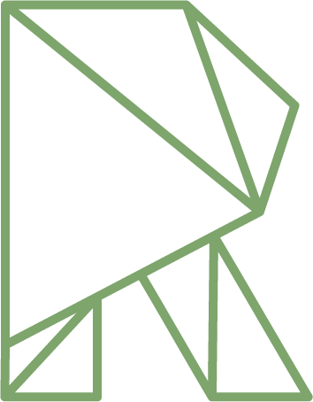
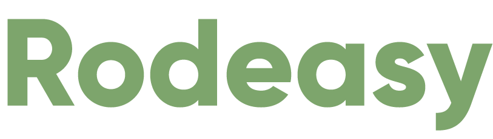

# UberHack - Projeto: Rodeasy

	
     
    

## O Evento

O Uber HACK - O Hackathon da Mobilidade é a primeira edição de um desafio nacional que vai buscar soluções de mobilidade para tentar resolver o quebra-cabeça que é o trânsito das nossas cidades. Convidamos a comunidade apaixonada por tecnologia a criar ou repensar projetos urbanos de mobilidade a partir de modelos que podem, inclusive, estar integrados ao aplicativo da Uber. 

https://www.uber.com/info/uberhack/sobre/

## O Projeto

Projeto desenvolvido durante o UberHack, hackaton que ocorreu nos dias 19 e 20 de Maio de 2018.

A solução propõe a união de pessoas que percorrem o mesmo caminho frequentemente e de carro para realizar um rodízio: cada motorista leva outros 4 num dia diferente da semana. O objetivo maior é a diminuição de veículos nas vias.

## O Time

Time formado por:

**Negócios:** Daisy Souza

**Designer:** [Dyogo Viana](https://github.com/DyogoViana)

**Designer:** [Natalia Oliveira](https://www.behance.net/nataliamso)

**Desenvolvedora:** [Talita Oliveira](https://github.com/talitaoliveira)